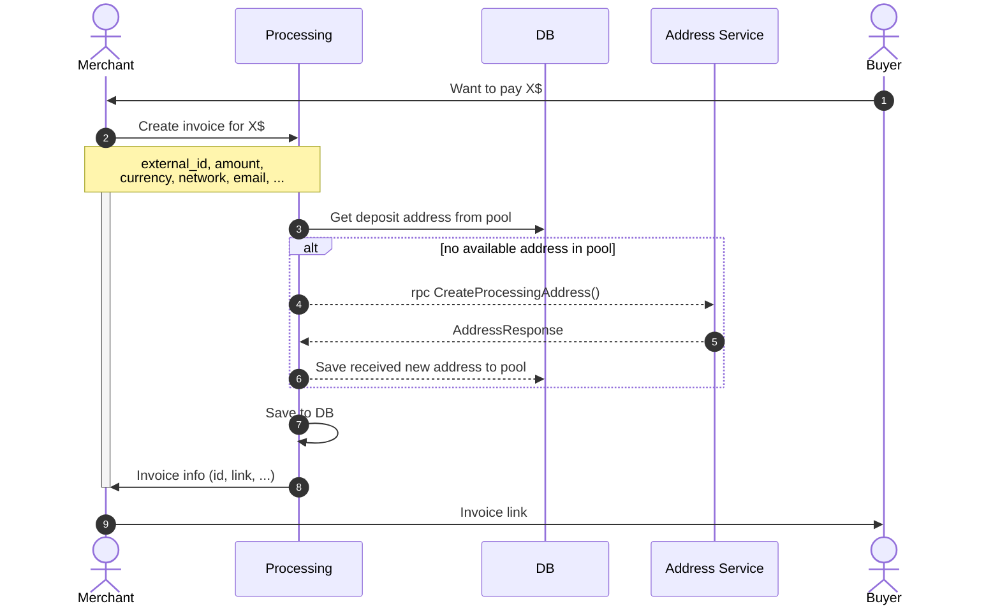
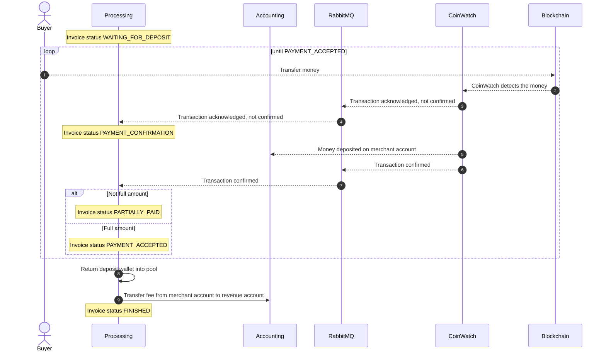
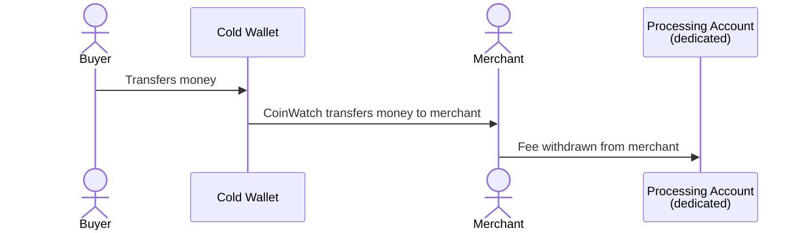

# ADR по сервису процессинга

## Мерчант создает платеж и отправляет юзера на оплату

> Часть данных может быть неизвестна при создании платежа. В таком случае фронт мерчанта или наш (наша форма оплаты)
> должна получить их от пользователя и только потом кинуть запрос на бэк для создания инвойса. Инвойс не может создаться
> при отсутствии хотя бы одного обязательного поля.

Если мерчанту хочет использовать нашу форму оплаты и предзаполнить в ней часть данных, то он может сделать это,
используя query-параметры ссылки на нашу форму, которую вставляет на наш сайт. Наш фронт при рендеринге возьмет данные и
заполнит нужные поля формы. После получения остальных полей от юзера он отправит запрос на создание инвойса и пойдет
дальше по флоу оплаты инвойса.

## Покупатель оплачивает инвойс

Address Pool, Processing - наши сервисы, мы их напишем с 0.

Accounting - используем существующий сервис.

Заметки:

1. CoinWatch отправляет данные через RabbitMQ, контракт согласуем перед началом разработки
2. Для отправки денег от мерчанта на счет с комиссиями используем метод ChangeBalance

## Схема движения средств

