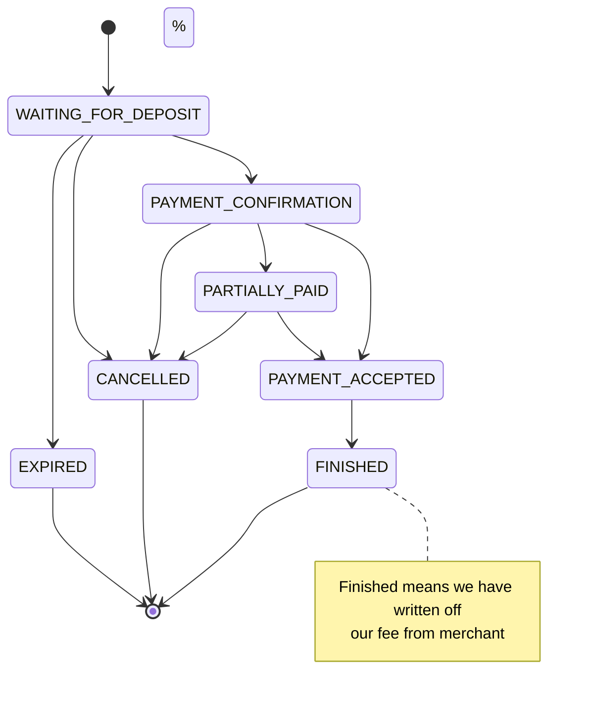

# Процессинг инвойса

Тут описано, как будем проводить инвойс по статусам

## Деплой

Это будет отдельным сервисом и deployment в кубере, чтоб мы могли горизонтально масштабировать и более гранулярно
выделять ресурсы.

Этот сервис подписывается на очереди в кролике и записывает полученные данные в БД, двигает инвойсы в другие статусы

## Переходы статусов



## Получение транзакций от coinwatch

### Схема БД

```postgresql
create type transaction_confirmation_status enum ('confirming', 'confirmed')

create table if not exists invoice_transaction
(
    invoice_id          uuid                            not null references invoice (id),
    hash                text                            not null,
    amount              decimal                         not null,
    sender_address      text                            not null,
    confirmation_status transaction_confirmation_status not null,
)
```

### Флоу

#### Структура сообщений в очереди

1. Адрес кошелька, куда пришли деньги
2. Хэш транзакции - чтоб отобразить покупателю
3. coin_id
4. amount
5. _Адрес кошелька, откуда деньги пришли_

#### Сообщение о том, что транзакция получена, но не подтверждена

1. Определяем, к какому инвойсу относится транзакция по coin_id, адресу кошелька _(обсудить с Сашей Колышкиным, почему
   сеть нам не нужна)_
2. Записываем транзакцию в БД
3. Если инвойс в статусе WAITING_FOR_DEPOSIT, то переводим в PAYMENT_CONFIRMATION

#### Сообщение о том, что транзакция подтверждена

1. Определяем, к какому инвойсу относится транзакция по coin_id, адресу кошелька _(обсудить с Сашей Колышкиным, почему
   сеть нам не нужна)_
2. Обновляем статус транзакции в БД на CONFIRMED
3. PAYMENT_CONFIRMATION -> PARTIALLY_PAID / PAYMENT_ACCEPTED

#### На что обратить внимание

Если мы будем вычитывать сообщения несколькими подами, то могут быть гонки между обновлением статуса инвойса. Видимо,
надо делать select for update инвойса при определении того, к какому инвойсу относится транзакция

