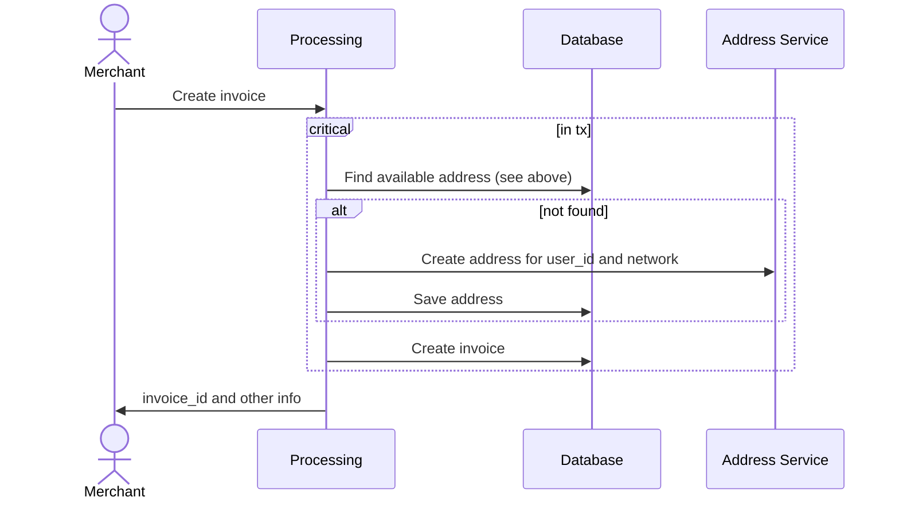
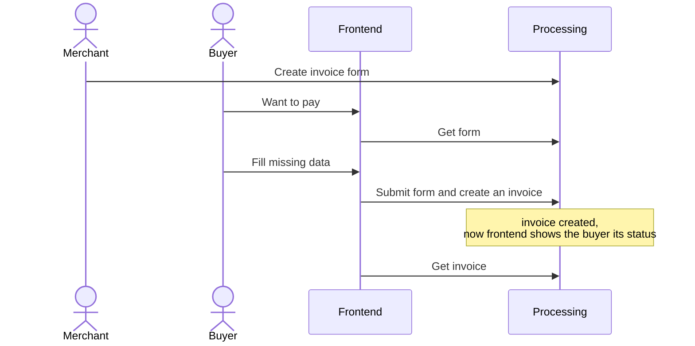

# API для юзера

Через это апи они будут создавать инвойсы и проверять его статус.

## Деплой

API - отдельный deployment и сервис в кубере, чтоб мы могли горизонтально масштабировать и не тратить слишком много
ресурсов

## Создание инвойса мерчантом

Мерчант со своего бэка создает инвойс, сразу предоставляя все необходимые данные

### Схема БД

```postgresql
create type invoice_status enum (
    'waiting_for_deposit', 
    'payment_confirmation', 
    'partially_paid',
    'payment_accepted',
    'finished',
    'expired',
    'cancelled' -- kyc, by merchant himslef or whatever
)

create table if not exists invoice
(
    invoice_id         uuid primary key,
    merchant_id        uuid           not null, -- use new user id
    coin_id            text           not null, -- use new id
    network_id         text           not null,
    deposit_address_id uuid           not null references deposit_address (address_id),
    amount             decimal        not null,
    title              text           not null default '',
    description        text           not null default '',
    checkout_url       text           not null default '',
    status             invoice_status not null,
    expires_at         timestamptz    not null

    -- to get already paid amount query invoice_transaction table
);

create table if not exists deposit_address
(
    address_id uuid primary key,
    network_id text not null,
    address    text not null,
    user_id    uuid not null,     -- address of merchant the address belongs to

    -- We can add "available" field or we can check occupied addresses in invoice table. 
    -- For now prefer later for the sake of normalization

    unique (network_id, address), -- sanity check
);

create index if not exists deposit_address_user_id_network_id_ix on deposit_address (user_id, network_id);
```

### Выбор свободного кошелька

left join активных инвойсов и выбираем те кошельки, у которых таких нет

```postgresql
SELECT da.address_id
FROM deposit_address da
         LEFT JOIN invoice i ON da.address_id = i.deposit_address_id
    AND i.status NOT IN ('finished', 'expired', 'cancelled')
WHERE da.network_id = $network_id
  AND da.user_id = $merchant_id
  AND i.id IS NULL -- No active invoice was found
LIMIT 1 FOR UPDATE;
```

Если ничего не нашли, то создаем новый в address сервисе, вставляем в БД и повторно запрос выбора не гоняем - сразу
используем новый созданный.

### Флоу



### Заметки

merchant_id получается из мидлвари авторизации на сервисе b2b-endpoint и передается в сервис процессинга.

coin_id, network_id должны быть известны фронту, чтоб дать пользователю селектор. Надо сделать какую-то ручку, отдающую
все опции, которые поддерживает наш сервис.

## Создание инвойса покупателем

Мерчант создает "форму" инвойса, заполняет там часть данных, а остальные должен заполнить пользователь при оплате.
Например, такое подойдет для донатов. Нужно, чтоб мерчант мог встроить нашу форму оплаты без интеграции на бэке, чисто
на фронт ссылку / iframe добавить

### Схема БД

```postgresql
create table if not exists invoice_form
(
    id          uuid primary key,
    merchant_id uuid not null, -- use new user id
    coin_id     text,          -- use new id
    network_id  text,
    amount      decimal,
    title       text not null default '',
    description text not null default '',
)
```

### Флоу

Мерчант создает в ЛК форму платежа, заполняет значения выше, часть оставляет пустыми (в базе null).

Покупатель открывает ссылку GET emcd.io/processing/:invoice_form_id и попадает на страницу, где ему надо дозаполнить
остальные поля. После этого фронт делает запрос POST emcd.io/processing/:invoice_form_id/submit и создается инвойс,
привязанный к мерчанту.

На беке мы достаем форму и перезаписываем только те значения, которые в ней были NULL. Если вдруг юзер-хацкер перепишет
на фронте заполненные мерчантом значения, то у себя мы их переписывать не должны.



## Статус инвойса

Просто достаем все инфо из базы и отдаем на фронт, он рисует красивую картинку
